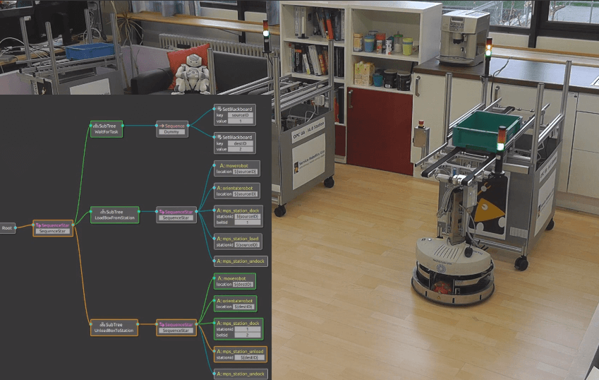

# What is POLARIS  
__"<font color="MediumSeaGreen">P</font>olicy and <font color="MediumSeaGreen">O</font>bject map description
<font color="MediumSeaGreen">L</font>anguage for <font color="MediumSeaGreen">A</font>utomated
<font color="MediumSeaGreen">R</font>obot <font color="MediumSeaGreen">I</font>ntelligence with
<font color="MediumSeaGreen">S</font>emantic behavior"__  

# Purpose
## Describe robotic behavior much more easilly.

Describing robotic behacior is very very hard task.  
We usually use algorithums such as behavior tree, PDDL (Planning Domain Definition Language) model etc...  
We try this problem by developing Domain Specific Language.  

Example of PDDL in robot navigation.
```
(:action navigate
:parameters (?r – rover ?x ?y - waypoint)
:precondition (and (available ?r)
(at ?r ?x)
(visible ?x ?y)
(>= (energy ?r) 8))
:effect (and
(decrease (energy ?r) 8)
(not (at ?r ?x ))
(at ?r ?y)))
```

Example of behavior tree in robot navigation.  
[](https://vimeo.com/304651183)

## Describe semantic behavior clearly.

By using POLARIS language, we can describe robotic behacior cleary such as "Go to in front of the white bouy and stop.", "Turn the red handle."
